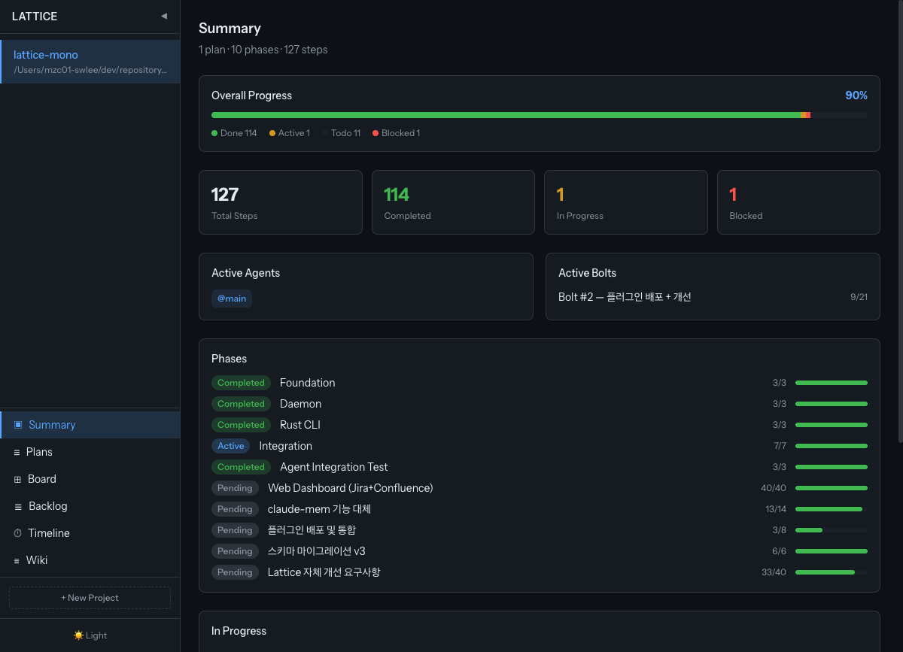
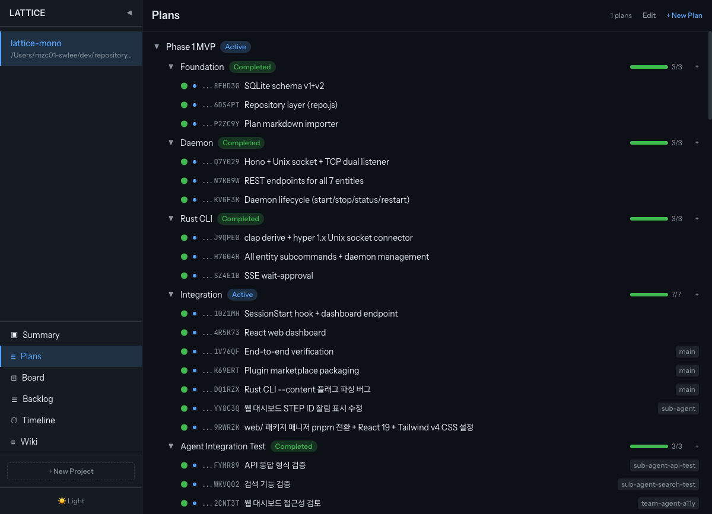
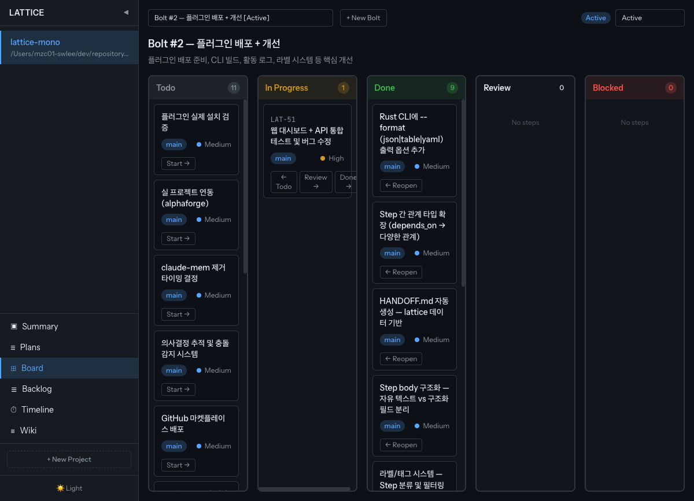
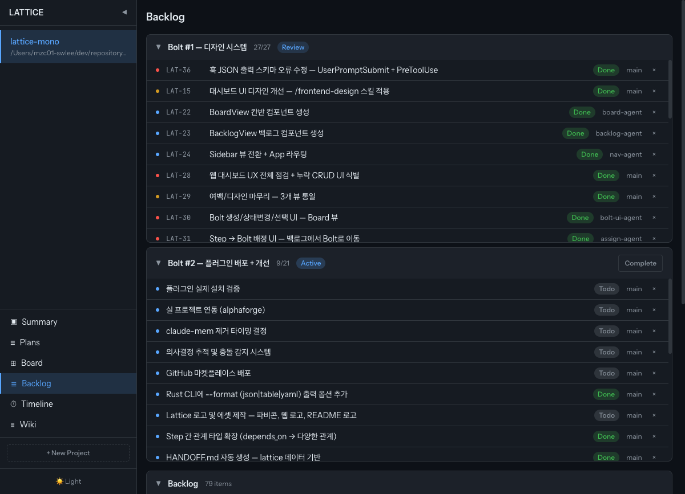
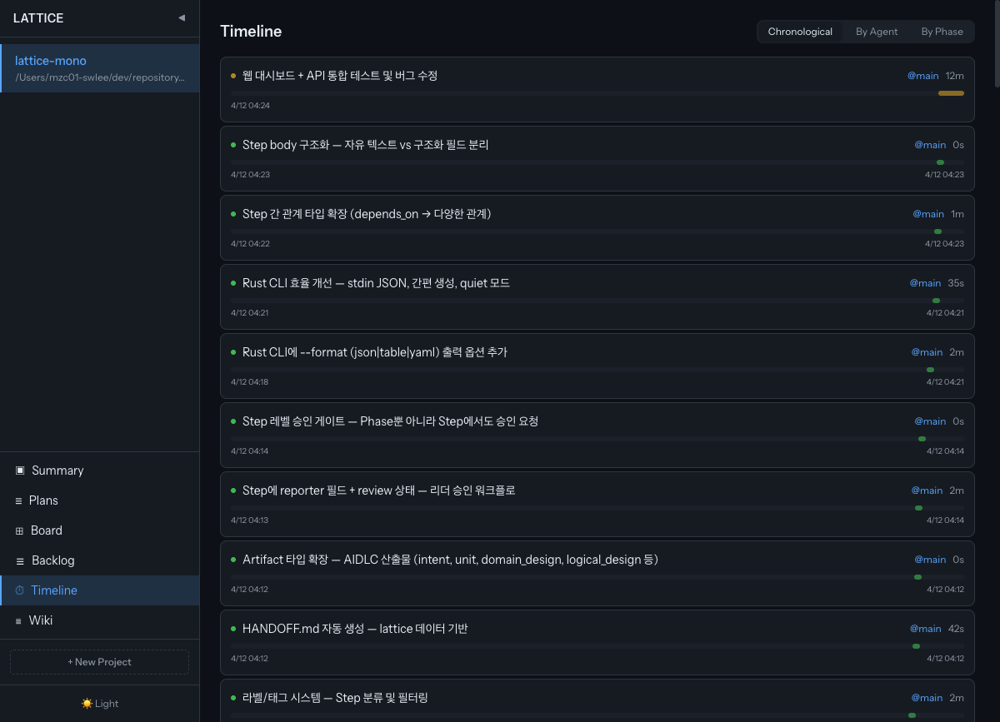
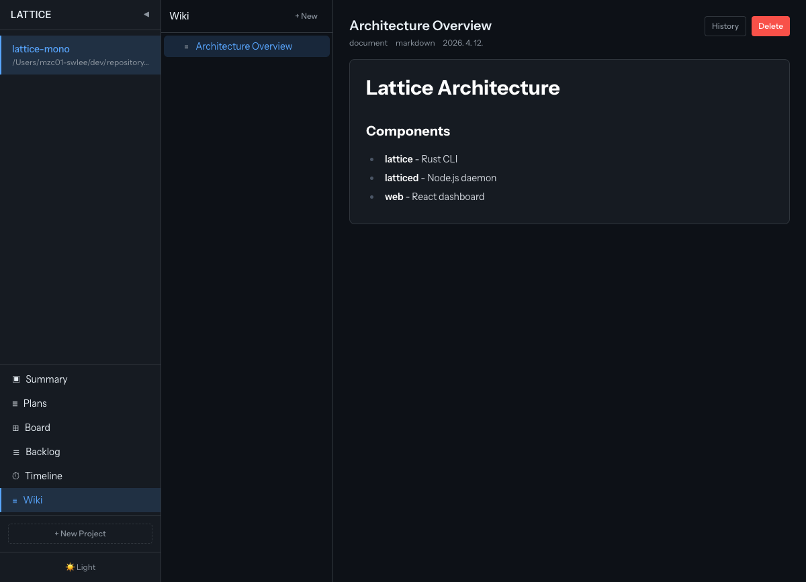

[한국어](README.ko.md)

<p align="center">
  
</p>

<h1 align="center">Lattice</h1>

<p align="center">LLM-native work management plugin for <a href="https://docs.anthropic.com/en/docs/claude-code">Claude Code</a></p>

Lattice is a structured state layer that replaces Jira + Confluence for LLM-driven development. It persists project plans, phases, steps, artifacts, and execution history across sessions via a local SQLite database and a lightweight daemon.

## Features

- **Structured Task Board** — Projects, Plans, Phases, Steps with full CRUD
- **Bolt Cycles** — Sprint-like iteration management (AIDLC bolt cycle support)
- **Web Dashboard** — Summary, Plans, Board (Kanban), Backlog, Timeline, and Wiki views
- **Drag & Drop** — Kanban DnD for status changes, backlog DnD for bolt assignment
- **Inline Editing** — Double-click step titles/status in Plans view to edit directly
- **Project Settings** — Edit project name, description, and working directories from Summary view
- **Artifact Wiki** — Markdown/JSON/YAML document management with version history
- **Vector Search** — FTS5 keyword + sqlite-vec semantic hybrid search
- **Ticket Numbers** — Human-readable IDs (LAT-1, LAT-2) alongside internal ULIDs
- **Unified Timeline** — Activity stream aggregating status changes, comments, artifacts, runs, and questions
- **Hook Integration** — Auto-injects project context into every Claude Code session
- **Step Enforcement** — Blocks work unless a step is registered (PreToolUse hook)
- **Plan Mode Compatible** — Auto-imports plans on ExitPlanMode
- **Auto Status Sync** — Stop hook auto-completes Phases/Plans when all steps are done
- **Token Optimization** — Completed phases show summary only in SessionStart context
- **Light/Dark Theme** — Theme toggle with persistent preference

## Installation

```bash
# 1. Add marketplace
/plugin marketplace add Seungwoo321/lattice

# 2. Install plugin
/plugin install lattice@Seungwoo321-lattice
```

Setup hook automatically installs daemon dependencies (`pnpm install`) on first use.

### Prerequisites

- [Claude Code](https://docs.anthropic.com/en/docs/claude-code) CLI
- Node.js 20+
- Rust toolchain (for building CLI from source, or use prebuilt binary in `bin/`)

## Architecture

```
Claude Code ──(hooks)──→ latticed (Node.js daemon)
           ──(CLI/Bash)─→ lattice (Rust binary)
                              │
                              ▼
                     ~/.local/share/lattice/db.sqlite

Web Dashboard (React) ──→ latticed HTTP API (static file serving)
```

## Project Structure

```
lattice/
├── cli/              # Rust CLI source
├── daemon/           # Node.js daemon source + migrations
│   ├── src/          # Server, repo, db, embeddings
│   └── web/          # Built React dashboard (plugin bundle, optional)
├── web/              # React dashboard source (dev only)
├── scripts/          # Hook scripts (.cjs)
├── hooks/            # hooks.json
├── skills/           # /lattice skill
├── prompts/          # rules.md (SessionStart injection)
├── bin/              # CLI binary (prebuilt)
├── screenshots/      # Dashboard screenshots
└── .claude-plugin/   # Plugin metadata
```

## Web Dashboard

Access at `http://localhost:<port>` when daemon is running. 6 views:

| View | Description |
|------|-------------|
| **Summary** | Project overview with progress, active agents, phase status |
| **Plans** | Tree view with inline editing, bulk actions, checkbox selection |
| **Board** | Kanban board with drag-and-drop status changes |
| **Backlog** | Bolt-grouped backlog with drag-and-drop assignment |
| **Timeline** | Unified activity stream with filters, day grouping, and run sparklines |
| **Wiki** | Artifact + project docs browser with markdown rendering |

### Screenshots

| Summary | Plans |
|---------|-------|
|  |  |

| Board (Kanban) | Backlog |
|----------------|---------|
|  |  |

| Timeline | Wiki |
|----------|------|
|  |  |

## Development

```bash
# Daemon
cd daemon && pnpm install

# Web dashboard
cd web && pnpm install && pnpm dev

# CLI
cd cli && cargo build
```

## License

MIT
